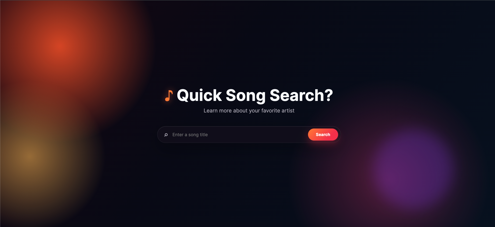
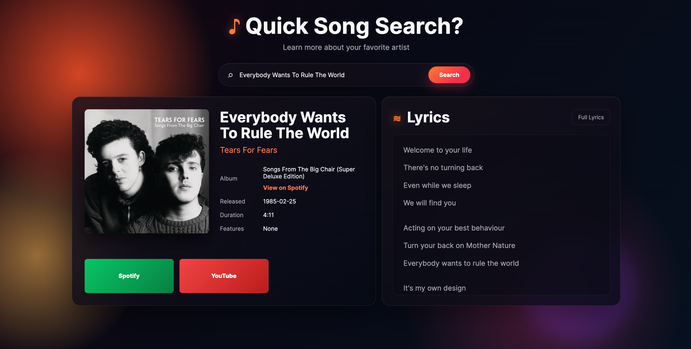

# 🎵 Music Explorer

A full-stack web application that allows users to search for songs and view detailed information about their favorite music.

Music Explorer uses the Spotify Web API to retrieve song information, including album artwork, artist details, release date, duration, and links to Spotify and YouTube. It also integrates with LRCLIB to display song lyrics.

---

Preview of Front Webpage


Example of Webage after a song search


---

## ✨ Features

- 🔎 Search for songs using the Spotify Web API
- Display:
  - Song title
  - Artist name
  - Album information
  - Album cover
  - Release date
  - Song duration
  - Featured artists
- Direct links to:
  - Spotify
  - YouTube
  - Genius lyrics search
- Display song lyrics using LRCLIB
- Secure API credential management using environment variables
- Built-in rate limiting to prevent excessive API requests

---

## 🛠️ Technologies Used

### Frontend

- HTML
- CSS
- JavaScript

### Backend

- Node.js
- Native HTTP server
- dotenv

### APIs

- Spotify Web API
- LRCLIB API

---

# 🚀 Installation & Setup

## Prerequisites

Before running this project locally, make sure you have:

- Node.js installed
- npm installed
- A Spotify Developer account

You can verify Node.js and npm installation:

```bash
node -v
npm -v
```

---

## 1. Clone the Repository

```bash
git clone YOUR_REPOSITORY_LINK
```

Navigate into the project folder:

```bash
cd song-finder
```

---

## 2. Install Dependencies

Install the required packages:

```bash
npm install
```

This will install all dependencies listed in `package.json`.

---

## 3. Create Environment Variables

Create a file named:

```
.env
```

inside the project folder.

Add your Spotify API credentials:

```env
SPOTIFY_CLIENT_ID=your_spotify_client_id
SPOTIFY_CLIENT_SECRET=your_spotify_client_secret
```

### How to get Spotify credentials:

1. Go to the Spotify Developer Dashboard
2. Create a new application
3. Copy your Client ID and Client Secret
4. Add them to your `.env` file

**Note:** Never upload your `.env` file to GitHub. Your credentials should remain private.

---

## 4. Start the Application

Run the backend server:

```bash
node server.js
```

You should see:

```
Server running at http://localhost:3000
```

---

## 5. Open the Application

Open your browser and visit:

```
http://localhost:3000
```

You can now search for songs.

---

# 📁 Project Structure

```
song-finder/
│
├── index.html        # Main webpage structure
├── style.css         # Application styling
├── updated.js        # Frontend JavaScript logic
├── server.js         # Node.js backend server
│
├── package.json      # Project information and dependencies
├── package-lock.json # Exact dependency versions
│
├── .env              # Private API credentials (not uploaded)
└── .gitignore        # Files ignored by Git
```

---

# 🔒 Security

This project uses environment variables to protect sensitive information.

API credentials are stored in:

```
.env
```

and loaded using:

```javascript
require("dotenv").config();
```

The `.env` file is excluded from version control using `.gitignore`.

---

# 📌 Future Improvements

Possible future updates:

- Allow multiple search results instead of only one song
- Add artist profiles
- Add recently searched songs
- Add user playlists
- Improve lyrics synchronization
- Deploy the application online

---

# 👨‍💻 Author

Najib Ahmed

Computer Science Student  
Hunter College

GitHub:
https://github.com/AhmedNajib762
